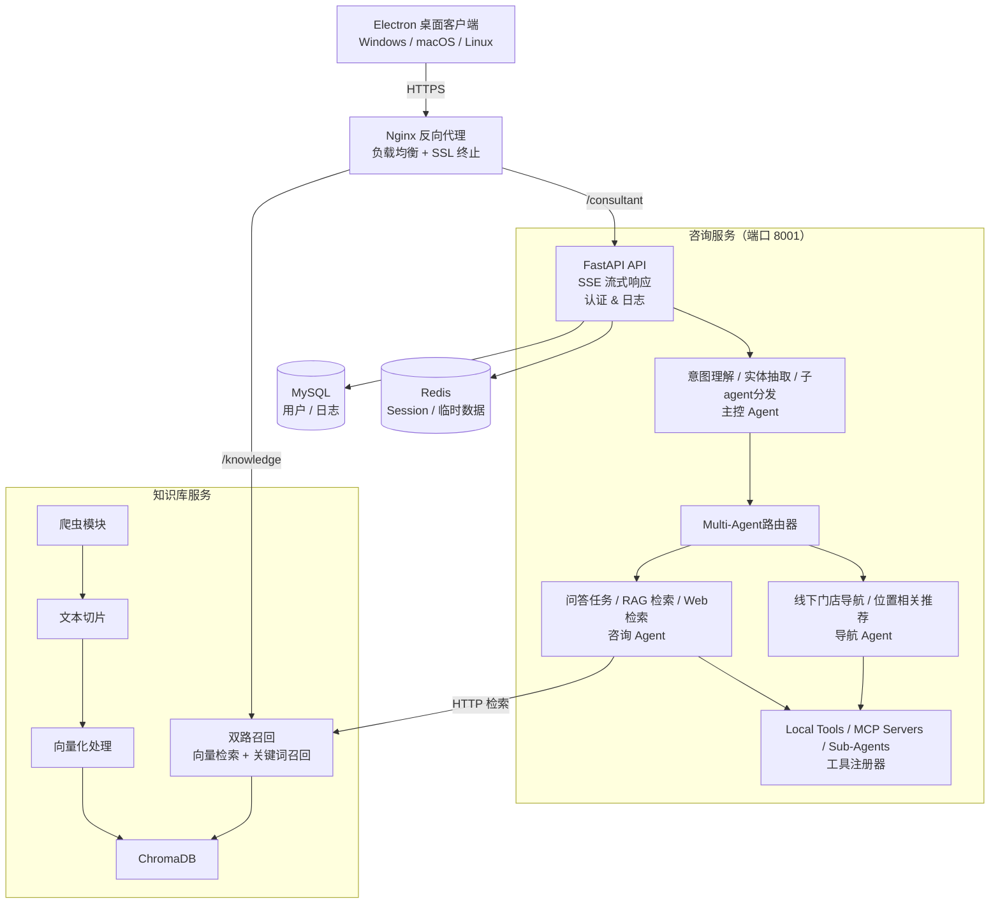
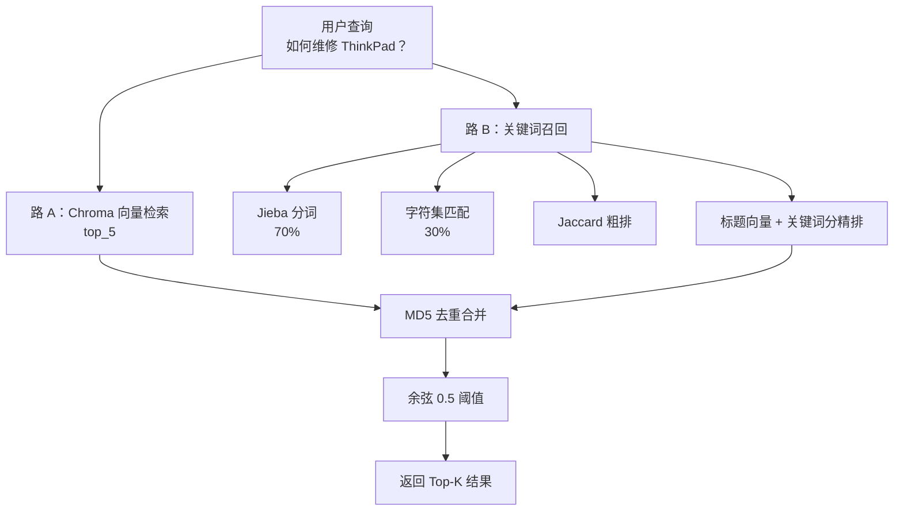

# Smart Nexus 🤖

> AI 原生的智能售后顾问系统 | Enterprise AI After-sales Consultant Platform

[](https://www.python.org/)
[](https://fastapi.tiangolo.com/)
[](https://docs.pydantic.dev/)
[](https://www.docker.com/)
[](LICENSE)

## 📋 项目概述

Smart Nexus 是一个 **AI 原生的微服务架构** 企业级智能售后顾问系统。核心亮点：

- 🔗 **多 Agent 编排**：三层 Agent + ReAct 思维链 + 动态工具路由
- 🧠 **MCP 工具集成**：接入 Tavily 搜索、百度地图、自定义 MCP Server
- 📚 **RAG 知识库**：向量检索 + 关键词双路召回，快速精准定位答案
- 🌊 **SSE 流式响应**：实时流式对话体验，支持思考过程可视化
- 🔐 **软吊销 JWT**：基于登录时间戳的灵活鉴权机制
- 📦 **微服务解耦**：Consultant + Knowledge 两个独立服务，各自可单独扩展

---

## 🏗️ 系统架构

### 整体架构与 Agent 编排



### Knowledge 核心 - 双路召回



---

## 🚀 快速开始

### 前置要求

- **Python**: 3.10+
- **Docker & Compose**: 27.0+ (推荐用容器部署)
- **MySQL**: 8.0+
- **Redis**: 7.0+
- **系统**: Ubuntu 22.04 LTS（推荐）或 Windows WSL 2

### 本地开发模式（不走 Docker）

#### 1. 克隆仓库

```bash
git clone https://github.com/zs2731070169-web/smart_nexus.git
cd smart_nexus
```

#### 2. 创建 Python 虚拟环境

```bash
# Consultant 服务
cd consultant
python -m venv venv
source venv/bin/activate  # Windows: venv\Scripts\activate
pip install -r requirements.txt

# Knowledge 服务（新终端）
cd ../knowledge
python -m venv venv
source venv/bin/activate
pip install -r requirements.txt
```

#### 3. 配置环境变量

```bash
# Consultant
cp consultant/.env.example consultant/.env
nano consultant/.env

# Knowledge
cp knowledge/.env.example knowledge/.env
nano knowledge/.env
```

配置示例见下方**环境变量说明**。

#### 4. 初始化数据库

```bash
# 创建数据库和表（MySQL 需提前启动）
mysql -u root -p < deploy/db/smart_nexus.sql
```

#### 5. 启动服务

```bash
# 终端 1：Consultant 服务 (8001)
cd consultant
python -m api.main

# 终端 2：Knowledge 服务 (8000)
cd knowledge
python -m api.main
```

### Docker 容器部署（推荐）

#### 1. 上传代码与配置

```bash
# 从本地上传到服务器
scp -r /path/to/smart_nexus root@your_server:/opt/

# 或使用 Git（需提前配置）
cd /opt
git clone https://github.com/you/smart_nexus.git
cd smart_nexus
```

#### 2. 一键部署

```bash
# 从项目根目录执行（脚本自动读 .env 的 MYSQL_PASSWORD）
bash deploy/cmd/deploy.sh
```

脚本会自动完成：
- 检查 Docker/Compose
- 创建数据目录
- 构建镜像
- 启动 5 个容器：nginx、consultant、knowledge、mysql、redis

#### 3. 验证部署

```bash
cd deploy/docker
docker compose ps
# 期望全部 Up

# 查看日志
docker compose logs -f consultant
docker compose logs -f knowledge
```

---

## ⚙️ 环境变量配置

### Knowledge 服务

```ini
# .env.example
[LLM]
API_KEY=your_api_key
BASE_URL=https://api.openai-proxy.org/v1
MODEL=gpt-4o-mini
EMBEDDING_MODEL=text-embedding-3-large

[Crawler]
KNOWLEDGE_BASE_URL=https://iknow.lenovo.com.cn
CRAWL_TIMEOUT=30
RETRY_COUNT=3
```

### Consultant 服务

```ini
[LLM]
# minimax（推荐）或 OpenAI 兼容接口
API_KEY=your_api_key
BASE_URL=https://api.minimaxi.com/v1
MAIN_MODEL_NAME=MiniMax-M2.7-highspeed        # 主 Agent 用
SUB_MODEL_NAME=MiniMax-M2.7-highspeed         # 子 Agent 用

[Database]
MYSQL_HOST=mysql                     # 容器环境填服务名
MYSQL_PORT=3306
MYSQL_USER=root
MYSQL_PASSWORD=your_strong_password  # 避免 $ 符号
MYSQL_DATABASE=smart_nexus
MYSQL_CHARSET=utf8mb4

[Cache]
REDIS_HOST=redis
REDIS_PORT=6379
REDIS_DB=0

[MCP]
TAVILY_BASE_URL=https://mcp.tavily.com/mcp
TAVILY_API_KEY=your_tavily_key
BAIDUMAP_BASE_URL=https://mcp.map.baidu.com/mcp
BAIDUMAP_AK=your_baidu_map_ak

[Service]
KNOWLEDGE_BASE_URL=http://knowledge:8000/smart/nexus/knowledge/retrieval/query
APP_PORT=8001
APP_HOST=0.0.0.0

[Auth]
SECRET_KEY=your_32_bytes_hex_key    # python3 -c "import secrets; print(secrets.token_hex(32))"
ALGORITHM=HS256
TOKEN_EXPIRE_HOURS=24

[Whitelist]
WHITE_LIST=["/smart/nexus/consultant/code","/smart/nexus/consultant/login"]
```

---

## 📁 项目结构

```
smart_nexus/
├── consultant/                      # 对话服务（FastAPI + Agent���
│   ├── api/
│   │   ├── main.py                 # 应用入口 + lifespan
│   │   └── router.py               # 路由定义
│   │
│   ├── agent/
│   │   ├── __init__.py
│   │   ├── node_agents.py          # 定义具体 Agent（consult_agent等）
│   │   ├── agent_router.py         # Agent 路由器 (AgentRouterRegistry)
│   │   └── runner.py               # Agent 执行引擎
│   │
│   ├── infra/
│   │   └── tools/
│   │       ├── base.py             # BaseTool + ToolRegistry
│   │       ├── __init__.py         # 工具注册
│   │       └── mcp/
│   │           ├── mcp_client.py   # MCP 长连接管理
│   │           └── mcp_servers.py  # MCP 服务端包装
│   │
│   ├── service/
│   │   ├── agent_service.py        # Agent 流式服务（SSE）
│   │   └── auth_service.py         # JWT 认证
│   │
│   ├── schema/
│   │   ├── request.py              # 请求数据模型
│   │   ├── response.py             # 响应数据模型
│   │   └── enums.py                # 枚举类
│   │
│   ├── config/
│   │   └── settings.py             # 配置类 (Pydantic)
│   │
│   ├── utils/
│   │   ├── tag_extract_utils.py    # <think> 标签流式拆分
│   │   └── middleware.py           # AuthTokenMiddleware
│   │
│   ├── test/
│   │   ├── unit_test.py
│   │   ├── agent_router_test.py
│   │   ├── integration_test.py
│   │   └── sse_api_test.py
│   │
│   ├── requirements.txt
│   ├── setup.py
│   ├── Dockerfile
│   └── .env.example
│
├── knowledge/                       # 知识库服务（RAG）
│   ├── api/
│   │   ├── main.py
│   │   └── router.py               # /retrieval/query 接口
│   │
│   ├── service/
│   │   └── retrieval/
│   │       ├── vector_retrieval.py # 路 A：Chroma 向量检索
│   │       ├── keyword_retrieval.py # 路 B：关键词召回
│   │       └── hybrid_retrieval.py # 双路合并与去重
│   │
│   ├── infra/
│   │   ├── vector_db/              # ChromaDB 包装
│   │   └── llm/                    # 向量化 LLM 调用
│   │
│   ├── cli/
│   │   ├── crawl_cli.py            # 爬虫 CLI
│   │   └── ingestion_cli.py        # 摄入 CLI
│   │
│   ├── test/
│   │   └── retrieval_service_test.py
│   │
│   ├── requirements.txt
│   ├── setup.py
│   ├── Dockerfile
│   └── .env.example
│
├── deploy/
│   ├── cmd/
│   │   └── deploy.sh               # 一键部署脚本
│   ├── docker/
│   │   └── docker-compose.yml      # 5 服务编排
│   ├── nginx/
│   │   ├── nginx.conf              # 反向代理配置
│   │   └── ssl/                    # SSL 证书（手动放置）
│   └── db/
│       └── smart_nexus.sql         # 数据库初始化
│
├── data/                           # 持久化数据（不进 Git）
│   ├── knowledge/
│   │   ├── crawl/                  # 爬虫输出 Markdown
│   │   └── chroma_kb/              # ChromaDB 向量库
│   ├── consultant/
│   │   ├── log/                    # 运行日志
│   │   └── history/                # 对话历史
│   ├── mysql/
│   └── redis/
│
├── CLAUDE.md                       # Claude Code 开发指南
├── DEPLOY.md                       # 详细部署文档
├── 项目介绍-面试版.md              # 架构设计文档
└── README.md                       # 本文件
```

---

## 🔌 核心 API 端点

### Consultant 服务

#### 获取验证码

```http
POST /smart/nexus/consultant/code
Content-Type: application/json

{
  "user_phone": "13800000000"
}

Response:
{
  "status": "200",
  "message": "验证码已发送"
}
```

#### 登录

```http
POST /smart/nexus/consultant/login
Content-Type: application/json

{
  "user_phone": "13800000000",
  "code": "123456"
}

Response:
{
  "status": "200",
  "data": {
    "token": "eyJhbGc...",
    "user": {
      "id": "user_001",
      "phone": "13800000000",
      "created_at": "2025-05-07T..."
    }
  }
}
```

#### 流式对话（SSE）

```http
POST /smart/nexus/consultant/chat/stream
Authorization: Bearer {token}
Content-Type: application/json

{
  "question": "我的 ThinkPad 连不上 WiFi 怎么办？",
  "session_id": "session_uuid"
}

Response (SSE EventStream):
data: {"type":"thinking","render_type":"THINKING","content":"用户问关于 WiFi 连接问题..."}
data: {"type":"processing","render_type":"PROCESSING","tool_calls":[{"name":"search_knowledge","args":{...}}]}
data: {"type":"answer","render_type":"ANSWER","content":"根据我查询到的内容...","citations":[...]}
```

### Knowledge 服务

#### 知识库检索

```http
POST /smart/nexus/knowledge/retrieval/query
Content-Type: application/json

{
  "question": "如何重装系统？",
  "top_k": 5
}

Response:
{
  "status": "200",
  "data": {
    "results": [
      {
        "title": "ThinkPad 重装 Windows 系统步骤",
        "content": "...",
        "score": 0.92,
        "source": "iknow.lenovo.com.cn"
      }
    ]
  }
}
```

---

## 🛠️ 开发指南

### 如何添加新工具

工具分两类：**本地工具** 和 **MCP 工具**

#### 添加本地工具

1. 创建工具类（继承 `BaseTool`）

```python
# consultant/infra/tools/my_tool.py
from infra.tools.base import BaseTool, ToolResult
from pydantic import BaseModel

class MyToolArgs(BaseModel):
    param1: str
    param2: int

class MyTool(BaseTool):
    def __init__(self):
        super().__init__(
            name="my_tool",
            description="我的自定义工具",
            args_schema=MyToolArgs
        )
    
    async def execute(self, args: MyToolArgs) -> ToolResult:
        # 实现逻辑
        result = do_something(args.param1, args.param2)
        return ToolResult(
            status="success",
            data=result
        )
```

2. 在工具注册表注册

```python
# consultant/infra/tools/__init__.py
from .my_tool import MyTool

tool_registry.register(MyTool(), category="custom")
```

3. 验证工具可用

```bash
# 启动服务后访问
curl http://localhost:8001/smart/nexus/consultant/tools
```

#### 接入 MCP 工具

在 `.env` 中配置 MCP Server 地址（已包括 Tavily、百度地图等）。MCP 长连接自动在 lifespan 启动：

```python
# api/main.ts
@app.lifespan
async def lifespan(app: FastAPI):
    # 启动 MCP 连接
    mcp_client.start_heartbeat()
    yield
    # 清理
    await mcp_client.cleanup()
```

### 如何添加新 Agent

1. 定义 Agent 实例

```python
# consultant/agent/node_agents.py
my_agent = Agent(
    name="my_agent",
    model="qwen3.5-flash",
    system_prompt="你是...",
    tools=[tool1, tool2],
    max_turns=5
)
```

2. 注册到 Agent 路由器

```python
# consultant/agent/__init__.py
from agent.node_agents import my_agent

agent_router_registry.register(
    agent=my_agent,
    description="我的 Agent 的功能描述"
)
```

3. 主控 Agent 自动可用

主控 Agent（coordination_agent）会自动发现注册的子 Agent，无需修改主控代码。

### 测试

```bash
# Consultant 单测（各文件独立可运行）
cd consultant
python test/unit_test.py
python test/agent_router_test.py
python test/integration_test.py

# Knowledge 单测
cd knowledge
python -m unittest discover -s test -v
python -m unittest test.retrieval_service_test

# 集成测试（需服务已启动）
python test/integration_test.py
```

---

## 🔐 安全性

### 鉴权机制（软吊销 JWT）

**原理**：JWT payload 记录 `iat`（签发时间），DB 存储 `user.login_time`。每次请求对比两者，登录时刷新 `login_time` 使所有旧 Token 立即失效。

```python
# consultant/service/auth_service.py
def verify_token(token: str) -> dict:
    payload = jwt.decode(token, settings.SECRET_KEY)
    user_id = payload['sub']
    iat = payload['iat']
    
    # 从 DB 查询最后登录时间
    user = db.query(User).get(user_id)
    
    # 比对：如果签发时间 < 最后登录时间，则已吊销
    if iat < int(user.login_time.timestamp()):
        raise InvalidTokenError("Token 已过期")
    
    return payload
```

### 白名单机制

不需要 Token 的公开接口（登录、获取验证码等）在白名单：

```python
# consultant/config/settings.py
WHITE_LIST = [
    "/smart/nexus/consultant/code",
    "/smart/nexus/consultant/login"
]
```

---

## 📊 性能优化

### MCP 长连接保活

心跳协程每 60 秒探活一次，失败立即重连：

```python
# consultant/infra/tools/mcp/mcp_client.py
async def start_heartbeat(interval: int = 60):
    while True:
        try:
            # 清缓存后探活
            server._tools = None
            await server.get_tools()
        except Exception:
            await self.cleanup()
            await self.connect()
        
        await asyncio.sleep(interval)
```

### SSE 流式指数退避

响应失败自动重试，重试间隔：`min(0.5 * 2^n, 10)` 秒，最多 20 次：

```python
# consultant/service/agent_service.py
async def stream_messages(question: str):
    for attempt in range(MAX_TRY_COUNT):
        try:
            yield await agent_service.run(question)
            return
        except ValueError:
            raise  # ValueError 短路不重试
        except Exception:
            wait_time = min(0.5 * (2 ** attempt), 10)
            await asyncio.sleep(wait_time)
    
    yield EXCEPTION_FRAME
```

### 知识库双路并行

向量检索和关键词召回并行执行，加快响应：

```python
# knowledge/service/retrieval/hybrid_retrieval.py
vector_results, keyword_results = await asyncio.gather(
    vector_retrieval.search(question, top_5),
    keyword_retrieval.search(question, top_5)
)

# 合并 + 去重 + 余弦阈值
return merge_and_deduplicate(vector_results, keyword_results)
```

---

## 🚀 部署

### 完整部署流程

详见 **DEPLOY.md**（完整 70 页部署文档）

快速版本：

```bash
# 1. 服务器初始化
sudo apt install -y docker docker-compose-plugin

# 2. 上传代码
git clone https://github.com/你的仓库/smart_nexus.git /opt/smart_nexus

# 3. 配置环境变量
cp consultant/.env.example consultant/.env
# 编辑 .env 填入 API Key 等

# 4. 配置域名和 SSL
mkdir -p deploy/nginx/ssl
# 将 SSL 证书放入此目录

# 5. 一键部署
bash deploy/cmd/deploy.sh

# 6. 验证
curl https://你的域名.com/smart/nexus/consultant/code
```

### 构建知识库

```bash
# 1. 设置爬取范围
nano knowledge/cli/crawl_cli.py  # 修改 range(0, 2000)

# 2. 执行爬取
docker compose exec knowledge python -m cli.crawl_cli

# 3. 执行摄入
docker compose exec knowledge python -m cli.ingestion_cli
```

---

## 📚 文档

| 文档 | 说明 |
|------|------|
| [CLAUDE.md](CLAUDE.md) | Claude Code 开发指南 |
| [DEPLOY.md](DEPLOY.md) | 云服务器详细部署文档 |

---

## 🐛 常见问题

### Q: Consultant 启动报 `Connection refused: MySQL`

**A**: MySQL 首次启动需执行初始化 SQL，耗时 1~2 分钟。deploy.sh 已配置健康检查，consultant 会自动等待。若超过 3 分钟仍未启动，查看日志：

```bash
docker compose logs mysql
```

### Q: MCP 连接超时

**A**: 检查网络连接与 API Key 配置。若境外服务器被百度地图拒绝，服务会自动降级，知识库问答不受影响。

### Q: Knowledge 检索结果为空

**A**: 确认知识库已构建完成：

```bash
docker compose exec knowledge python -m cli.ingestion_cli
```

若仍为空，检查 ChromaDB 数据是否存在：

```bash
ls -la data/knowledge/chroma_kb/
```

---

## 🤝 贡献指南

欢迎 PR 和 Issue！请遵循以下规范：

### 代码规范

- **语言**：简体中文注释与文档
- **格式**：Python 代码遵循 PEP 8
- **类型**：使用 Pydantic 进行数据验证

### 提交流程

1. Fork 项目
2. 创建特性分支：`git checkout -b feature/your-feature`
3. 提交代码：`git commit -am 'feat: 新增功能'`
4. 推送分支：`git push origin feature/your-feature`
5. 提交 Pull Request

---

## 📄 许可证

MIT License © 2025 zs2731070169-web

---

## 📞 联系方式

- **GitHub Issues**：[反馈问题](https://github.com/zs2731070169-web/smart_nexus/issues)
- **GitHub Discussions**：[讨论想法](https://github.com/zs2731070169-web/smart_nexus/discussions)

---

## 🔗 相关项目

- **[Smart Nexus UI](https://github.com/zs2731070169-web/smart-nexus-ui)** - 前端应用
- **[项目文档](https://github.com/zs2731070169-web/smart-nexus-docs)** - 完整文档站点

---

<div align="center">

**⭐ 如果对你有帮助，请给个 Star！**

[English](README.md) | [简体中文](README.md)

Made with ❤️ by zs2731070169-web

</div>
